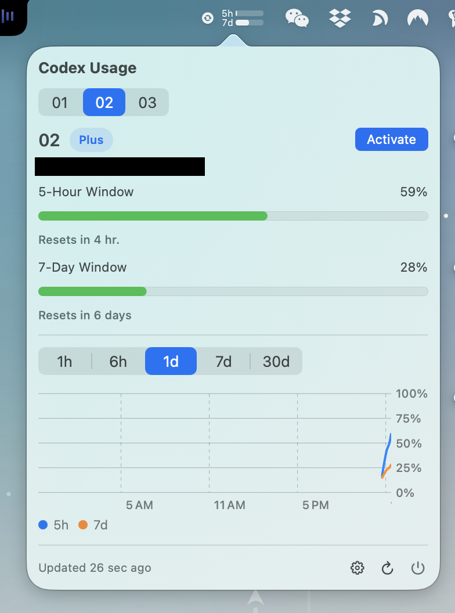

# Codex Switcher Menubar

A lightweight macOS menu bar app for people who want two things fast:

- switch Codex / ChatGPT accounts quickly
- check usage at a glance without opening a bigger desktop app

It keeps the workflow minimal, stays out of the way, and makes the "which account am I on right now?" question much easier to answer.



## Why This Exists

I built this for my own daily workflow.

The original [Codex Switcher](https://github.com/Lampese/codex-switcher) is great, but I wanted something more lightweight:

- always available from the menu bar
- optimized for fast account switching
- focused on quick usage checks
- simple enough to live in the background all day

This project is not trying to replace Codex Switcher. It is a smaller, faster, menu-bar-first interpretation of that workflow.

## What It Does

- Switch between stored ChatGPT accounts from the macOS menu bar
- Show current usage for the 5-hour and 7-day windows
- Visualize recent usage history with a compact chart
- Refresh usage manually whenever you want
- Add accounts with the official ChatGPT OAuth flow
- Import existing accounts from `.cswf` exports or `auth.json`
- Open a management window for account setup, cleanup, and migration

## Why You Might Like It

- You use multiple accounts and switch often
- You care about usage visibility more than a full desktop manager
- You want fewer clicks and less window clutter
- You prefer small utilities that do one job well

## Installation

### Download A Release

Download the app from the project releases, then move it into `Applications`.

If macOS blocks the app because it was downloaded from the internet, run:

```bash
xattr -d com.apple.quarantine /Applications/CodexSwitcherMenubar.app
```

If you just want the core command handy, this is the part that matters:

```bash
xattr -d com.apple.quarantine
```

### Build From Source

Requirements:

- macOS 14+
- Xcode Command Line Tools
- Swift 6.3+

Build and run:

```bash
swift build
swift run CodexSwitcherMenubar
```

Build a `.dmg` release artifact:

```bash
./scripts/build-release.sh 0.1.0
```

## Notes

- This is an unofficial personal project
- It is not affiliated with, endorsed by, or supported by OpenAI, ChatGPT, Anthropic, or Claude
- Use it at your own risk and follow the relevant product terms

## Credits

- UI style inspiration: [Claude Usage Bar](https://github.com/Blimp-Labs/claude-usage-bar)
- Account-switching workflow inspiration: [Codex Switcher](https://github.com/Lampese/codex-switcher)
- If you want the fuller original app experience, you should use Codex Switcher directly
